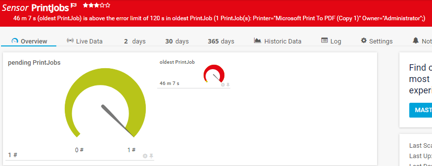

# PRTG-PrintJobs
# About

## Project Owner:

Jannos-443

## Project Details

Monitors pending PrintJobs and PrintJobs Age
Sensor message shows PrinterQueue and Job Owner.


## HOW TO

1. Place `PRTG-PrintJobs.ps1` under `C:\Program Files (x86)\PRTG Network Monitor\Custom Sensors\EXEXML`

2. Create new Sensor 

   | Settings | Value |
   | --- | --- |
   | EXE/Script Advanced | PRTG-PrintJobs.ps1 |
   | Parameters | -ComputerName %host |
   | Security Context | Use Windows credentials of parent device" or use "-Username" and "-Password" |
   
3. Set the "$IncludeName", "$ExcludeName", "IncludeUser" or "ExcludeUser" parameter to Exclude PrinterQueues

<br>

## Usage

```powershell
-Computername "%host" -ExcludeName '^(TestPrinter.*)$'
```
Excludes all PrintJobs from printers beginning with TestPrinter

```powershell
-Computername "%host" -IncludeName '^(TestPrinter.*)$'
```
Only includes PrintJobs from printers beginning with TestPrinter

```powershell
-Computername "%host" -ExcludeUser '^(TestUser)$'
```
Excludes all PrintJobs from the user TestUser

```powershell
-Computername "%host" -Username "%linuxUser" -Password "%linuxpassword"
```
use Username and Password instead of "Windows Credentials" (not recommended)

## Examples




## Non Domain or IP

If you connect to **Computers by IP** or to **not Domain Clients** please read [Microsoft Docs](https://docs.microsoft.com/en-us/powershell/module/microsoft.powershell.core/about/about_remote_troubleshooting?view=powershell-7.1#how-to-use-an-ip-address-in-a-remote-command)

you maybe have to add the target to the TrustedHosts on the PRTG Probe and use explicit credentials.

example (replace all currenty entries): 

    Set-Item -Path WSMan:\localhost\Client\TrustedHosts -Value "ServerIP1,ServerIP2,ServerHostname1"

example want to and and not replace the list:
    
    $curValue = (Get-Item wsman:\localhost\Client\TrustedHosts).value
    Set-Item WSMan:\localhost\Client\TrustedHosts -Value "$curValue,NewServer3.test.com"
    
exmaple PRTG parameter with explicit credentials:
    
    -ComputerName "%host" -Username "%windowsuser" -Password "%windowspassword"


## Includes/Excludes

You can use the variables to exclude/include PrintJobs
The variables take a regular expression as input to provide maximum flexibility.

For more information about regular expressions in PowerShell, visit [Microsoft Docs](https://docs.microsoft.com/en-us/powershell/module/microsoft.powershell.core/about/about_regular_expressions).

".+" is one or more charakters
".*" is zero or more charakters
