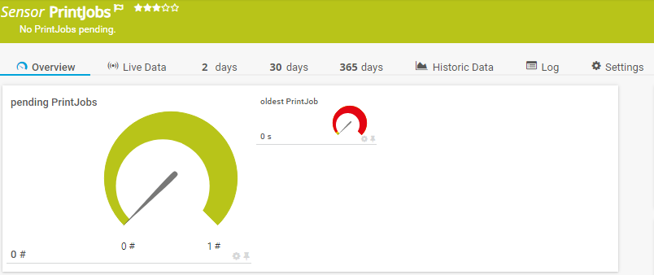

# PRTG-PrintJobs-Age
# About

## Project Owner:

Jannos-443

## Project Details

Monitors pending Print Jobs older than x minutes.
Sensor message shows PrinterQueue and Job Owner.

Default Values:
- Age = 1 (minutes)

## HOW TO

1. Place `PRTG-PrintJobs-Age.ps1` under `C:\Program Files (x86)\PRTG Network Monitor\Custom Sensors\EXEXML`

2. Create new Sensor 

   | Settings | Value |
   | --- | --- |
   | EXE/Script | PRTG-PrintJobs-Age.ps1 |
   | Parameters | -ComputerName %host -Age 5 |
   | Security Context | Use Windows credentials of parent device" or use "-Username" and "-Password |
   
3. Set the "$IgnorePattern" or "$IgnoreScript" parameter to Exclude PrinterQueues

## Examples



Printer exceptions
------------------
You can either use the **parameter $IgnorePattern** to exclude a Printer on sensor basis, or set the **variable $IgnoreScript** within the script. Both variables take a regular expression as input to provide maximum flexibility. These regexes are then evaluated againt the **PrinterQueue Name**

By default, the $IgnoreScript varialbe looks like this:

```powershell
$IgnoreScript = '^(TestExclude123|TestExcludeWildcard.*)$'
```

For more information about regular expressions in PowerShell, visit [Microsoft Docs](https://docs.microsoft.com/en-us/powershell/module/microsoft.powershell.core/about/about_regular_expressions).

".+" is one or more charakters
".*" is zero or more charakters
